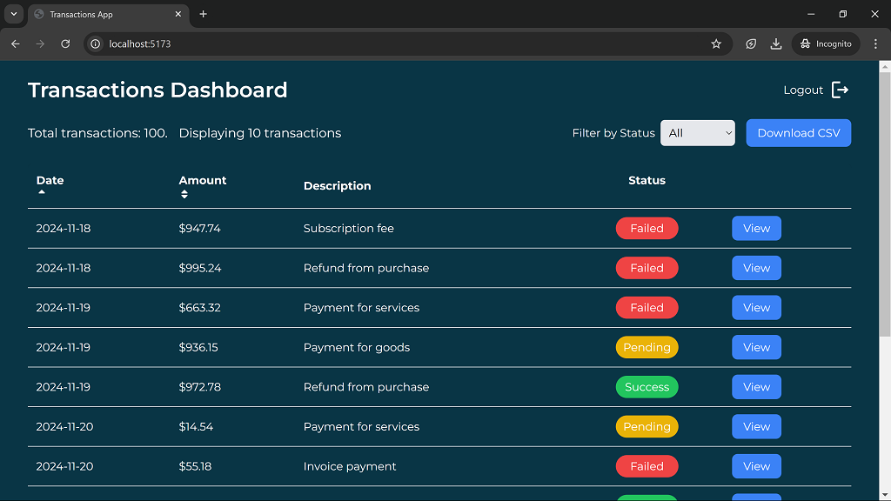
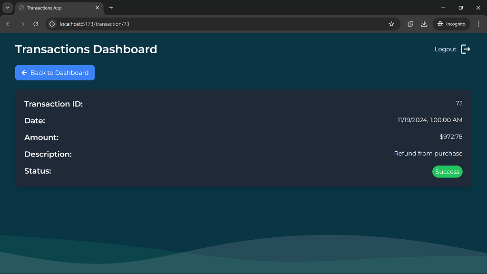

# Transactions Dashboard Application

This is a web application built with **React**. It provides a dashboard to view, filter, sort, and paginate transactions. Users can also download transaction data as a CSV file. The application includes a **login page** with a test user for authentication (for demo purposes).

## Table of Contents

- [Overview](#overview)
  - [The Challenge](#the-challenge)
  - [Screenshot](#screenshot)
  - [Links](#links)
- [My Process](#my-process)
  - [Built With](#built-with)
- [Setup](#setup)
- [Author](#author)

## Overview

### The Challenge

The goal of this project was to create a **transaction dashboard** with the following features:

- View a list of transactions
- Filter transactions by status (e.g., Success, Pending, Failed)
- Sort transactions by date or amount
- Paginate the transaction list
- Download the transaction data in CSV format
- A simple **login page** that allows users to authenticate with a test user (no real authentication system is implemented)

This is a **frontend-only** application with all data mocked in the frontend. No backend service is required.

### Screenshot

- 
-
- 

### Links

- Live Site URL: [Transactions Dashboard](https://transactions-dashboard-andemosa.vercel.app)

## My Process

### Built With

- [React.js](https://react.dev/)
- [TailwindCSS](https://tailwindcss.com/)
- [React Icons](https://react-icons.github.io/react-icons/)
- [Zustand](https://zustand.docs.pmnd.rs/getting-started/introduction)

### Features Implemented

- **Transactions Table**: Displays a list of transactions with sortable columns (Date, Amount).
- **Filters**: Users can filter transactions by status (Success, Pending, Failed).
- **Pagination**: The transactions list is paginated, displaying 10 items per page.
- **CSV Export**: Users can download the displayed transactions as a CSV file.
- **Login Page**: The app uses a mock login page with a test user (no actual authentication logic).

## Setup

### Prerequisites

- **Node.js** (for local development)
- **npm** (or **yarn**) for package management

### Cloning the Repository

Start by cloning the repository to your local machine:

```bash
git clone https://github.com/andemosa/transactions-dashboard.git
cd transactions-dashboard

```

### Running the Application

- Install dependencies: `npm install`.
- Start the frontend application: `npm run dev`.
- The application should now be running on `http://localhost:5173` but verify this in your command line terminal

## Author

- Anderson Osayerie - [@andemosa](https://andemosa.tech)
- Twitter - [@andemosa](https://www.twitter.com/andemosa)
